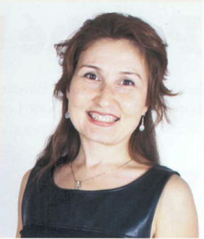

I have just arrived in Victoria BC, with a work permit, and I wish to resume my career in finance after a break caused by my temporary stay in NY. During the break, I homeschooled my kids, I learned Python, and I took refreshment courses in Finance on Coursera.  

I have almost 15 years of work experience, of which nine in the alternative investment sector. I hold a Master of Advanced Studies in Finance (Financial Assets Management and Engineering) from the University of Lausanne, HEC, and Master’s degrees in Economics from University Pompeu Fabra, Barcelona, and Central European University, Budapest. 

> You may download [my CV](webdocs/CV.pdf).

My previous position was Head of Research with Insch Capital Management SA, in Lugano, Switzerland.
In this role I coordinated research and reporting, prepared client presentations and marketing materials, back-tested investment ideas, built trading strategies, performed NAV reconciliation, client support, and performance/risk analysis.

Our research was often published in financial journals and magazines. [Here is a non-comprehensive list of our publications.](research0.md)  

Prior to Insch, I was a Senior Financial Analyst for pension fund investments with DL Investment Partners in Zug, Switzerland. In that position, I have performed manager selection, due diligence, qualitative and quantitative analysis, and dedicated client reporting. 

In the academy, I have experience as Research Assistant, Teaching Assistant, and Mentor/Grader for the CFA Institute GIRC competition. In 2010 I was invited to teach two Masters' courses at Toulouse ESEC Business School - Portfolio Management and Risk Management.
(Syllaby [here](webdocs/PM Syllabus.pdf) and [here](webdocs/PM Syllabus.pdf)).