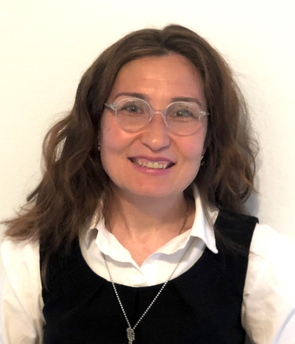

I am an experienced Financial Analyst with a passion for research, performance analysis, and risk management. With over 15 years of professional experience in finance, including roles in alternative investments, accounting, and academics, I bring a wealth of knowledge and expertise in the financial industry. I hold a Master's degree in Finance from the University of Lausanne, HEC, and Master's degrees in Economics from University Pompeu Fabra and Central European University.

<!-- *You may download [my CV](webdocs/CV.pdf)*. -->

In my previous roles, such as Acting Associate at BCI Investment Management and Head of Research at Insch Capital Management SA, I gained extensive knowledge of investment procedures, performance reporting, risk management, and client service. 

I also have experience in accounting and in academia, where I taught and assisted courses on financial mathematics, portfolio management, and risk management.

Currently, I am volunteering at the CFA Society Victoria for the Financial Literacy Project, providing financial advice to underserved demographics. So far, we have delivered 7 workshops, most notably at Anawim House and Inter-Cultural Association of Victoria.    

Overall, my experience and skills make me well-equipped to excel in the field of financial analysis. I am excited to use my expertise and expand my knowledge in new and challenging roles.

<!--As an experienced Financial Analyst with a passion for research, performance analysis, and risk management, I bring a wealth of knowledge and expertise to the table. 

I have over fifteen years of professional experience in various roles within the financial industry. This includes nine years in the alternative investment sector, four years in accounting, and two years in academics. I hold a Master of Advanced Studies in Finance (Financial Assets Management and Engineering) from the University of Lausanne, HEC, and Master’s degrees in Economics from University Pompeu Fabra, Barcelona, and Central European University, Budapest.

> You may download [my CV](webdocs/CV.pdf).

As an Acting Associate, Performance & Analytics with BCI Investment Management, I gained extensive knowledge of the company's investments and procedures, deepened my understanding of performance reporting and reconciliation, and became proficient in SCD, as well as familiar with PBI and PowerQuery. As an Acting Analyst - Public Markets Risk Management, I was part of the team effort of creating a dashboard for fixed income risk reporting and working on ad-hoc projects related to market risk exposures and the impact of interest rates on FI products. 

As Head of Research with Insch Capital Management SA in Switzerland I coordinated market research, performance, and risk reporting, prepared client presentations and marketing materials, back-tested investment ideas, built trading strategies, performed NAV reconciliation, client service, and operations. Our research was often published in financial journals and magazines. [Here is a non-comprehensive list of our publications.](research0.md)  

During my time as a Senior Financial Analyst with DL Investment Partners, I was responsible for manager selection, due diligence, qualitative and quantitative analysis, NAV reconciliation, and internal and client reporting. 

My experience also includes teaching and research assistantship in academia. I had the great opportunities to teach two Masters’ courses at Toulouse ESEC Business School on Portfolio Management and Risk Management, assist in teaching Financial Mathematics and Asset Pricing at Univerity of Nechatel, and to serve as a mentor/grader for the CFA Institute GIRC competition.
(Syllaby [here](webdocs/PM Syllabus.pdf) and [here](webdocs/RM Syllabus.pdf)).

Currently, I am volunteering at the CFA Society Victoria for the Financial Literacy Project, an initiative aimed at providing financial advice to underserved demographics.

Overall, my experience has equipped me with the knowledge and skills necessary to thrive in the field of financial analysis, and I am excited to continue applying my expertise in new and challenging roles.

<!--At BCI Corporation, where I work until the end of April 2023, I started as Acting Analyst - Public Markets Risk Management and later moved to the role of Acting Associate, Performance & Analytics. These roles allowed me to gain a deep understanding of BCI's investments and procedures, and I became proficient in SCD, as well as familiar with PBI and PowerQuery.

My previous work experience includes ten years in the alternative investment sector, four years in accounting, and two years in academics. 

I hold a Master of Advanced Studies in Finance (Financial Assets Management and Engineering) from the University of Lausanne, HEC, and Master’s degrees in Economics from University Pompeu Fabra, Barcelona, and Central European University, Budapest. 

> You may download [my CV](webdocs/CV.pdf).

Previously, I was a Senior Financial Analyst with DL Investment Partners, an investment advisor for public pension funds, in Switzerland. In that position, I performed manager selection, due diligence, qualitative and quantitative analysis, NAV reconciliation, and tailored client reporting. 

I have additional experience as Teaching/Research Assistant, and Mentor/Grader for the CFA Institute GIRC competition. In 2010 I was invited to teach two Masters' courses at Toulouse ESEC Business School - Portfolio Management and Risk Management.
(Syllaby [here](webdocs/PM Syllabus.pdf) and [here](webdocs/RM Syllabus.pdf)).

Since March 2021, I volunteer at the CFA Society Victoria for the Financial Literacy Project, an initiative aimed to help certain demographics that are underserved by professional financial advice.
-->