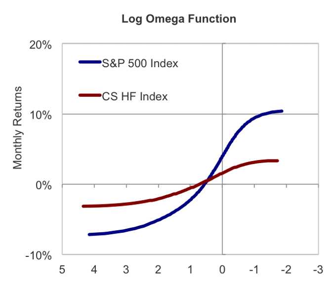

### What keeps me up...

- Early in the COVID pandemic, I used the Bayes theorem to assess the probabilites of succumbing to the disease, conditional on the infected person's gender.

["Bayes Theorem applied to predict conditional mortality rates", Apr.2020](webdocs/BayesTheoremandCOVID.pdf)

- Comments on the impact of COVID Vaccination on hospitalizations and deaths data from France, DREES.

["COVID Vaccination Findings based on DREES research", Sep.2021](webdocs/COVIDVaccinationFindings.pdf)

### With Insch Capital Management

#### Asymmetric Deviation as a risk measure

- Asymmetric Deviation was introduced by Insch Capital Management as an improvement to standard deviation. It multiplies standard deviation by the ratio between the downside deviation and the upside deviation of returns.

["A New Way to Measure Risk", Insch CM, Jan.2017](webdocs/Non-StandardDeviation_17_01.pdf)

- We showed that Asymmetric Deviation can successfully replace standard deviation in building optimal (minimum risk) portfolios. 

["The True Deviation of Returns and Portfolio Optimization, Insch CM, Feb.2017"](webdocs/TDandMinRiskPortfolios17_02.pdf)

#### Omega measure based on the Kernel Distribution

The Omega measure provides a way to describe the holistic distribution of performance for any kind of strategy or benchmark. At Insch, we calculated Omega in the logarithmic form on the kernel distribution of returns, to smooth results while considering every observation an outcome of a random event. In addition, by inverting the axes of the usual Omega graph we obtained a more intuitive view of the performance domain. All these alterations enable easier comparisons between various investments' performances.

This inverted plot (with log-Omega in descending order on the x-axis) has useful properties:

- it crosses the y-axis at the mean of the returns' distribution;

- for similar variances, higher curve position is associated with higher returns; 

- larger odd moments (such as skewness) also lead to higher curves;

- higher variances are reflected in steeper slopes.

#### Volatility Drag

It is the negative impact of compounding volatile returns on the total return of a strategy. 

Consider two investments, one risk-free and one risky, over two time periods. Say the risky investment yields returns $r_1$ in the first period and a different $r_2$ in the second period. Also, assume the risk-free investment yields a constant return $r$ equal to the average of the risky investment returns. 
The difference in the total returns between the risky and the riskless investments is the volatility drag: 

$(1+r_1)(1+r_2) - (1+r)^2 = -(1/4)(r_1-r_2)^2$, always negative. 

For Geometric Brownian Motions, expected total return has the
expression $E(R) = \mu - \sigma^2/2$, where $-\sigma^2/2$ is the volatility drag. 

If leverage is applied, so exposure is increased by a factor $n$, the volatility drag term increases by the factor $n^2$. 

A trading strategy could aim to minimize the volatility drag by decreasing exposures when high volatility is expected and vice versa.

### With DL Investment Partners 

- I have performed Returns-Based-Style-Analysis, to track eventual style drift by individual foreign exchange managers. The results are, however, strongly affected by the choice of style benchmarks. 

- I have calculated decompositions of total portfolio variance by individual contributions to risk of individual asset managers. These decompositions allow for the construction of straightforward minimum risk portfolios, by equalizing the risk contributions of individual managers.

- I have written practical guides for using statistical measures such as [Omega](webdocs/Omega in practice.pdf), [Ljung-Box](webdocs/Ljung Box test - practical guide.pdf), [Jarque-Bera](webdocs/Jarque-Bera test - practical guide.pdf), Chi-square, and F-tests.