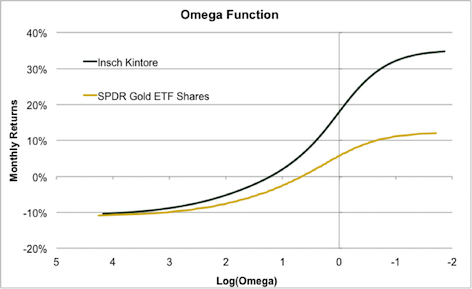

Notable new things from Insch CM research:

#### Asymmetric Deviation as a risk measure for a managed portfolio or strategy:

First, we argue that standard deviation is an uninformative investment metric and replace it with the “Non-Standard” Deviation or “True” Deviation: an adjusted measure of risk which multiplies standard deviation by the ratio between the downside deviation and the upside deviation of returns.

["A New Way to Measure Risk", Insch CM, Jan.2017](webdocs/Non-StandardDeviation_17_01.pdf)

Next, we check if and how True Deviation can replace standard deviation in building optimal minimum risk portfolios. 

["The True Deviation of Returns and Portfolio Optimization, Insch CM, Feb.2017"](webdocs/TDandMinRiskPortfolios17_02.pdf)

#### Omega measure based on the Kernel Distribution

We use the Omega measure as a way to describe the holistic disribution of performance across strategies (or benchmarks.)

The use of the kernel distribution has two advantages. First, it assumes that every performance record is simply a realization of a statistical performance distribution, which we attempt to retrieve to build a generalized distribution of strategy returns. Second, the kernel distribution and the associated omega function are smoother, thus easier to interpret.

By inverting the axes of the Omega graph we get an alternative comparative view of the returns' magnitude.